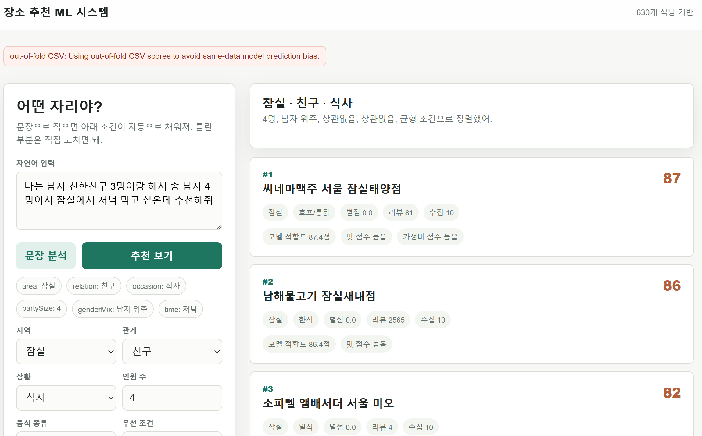
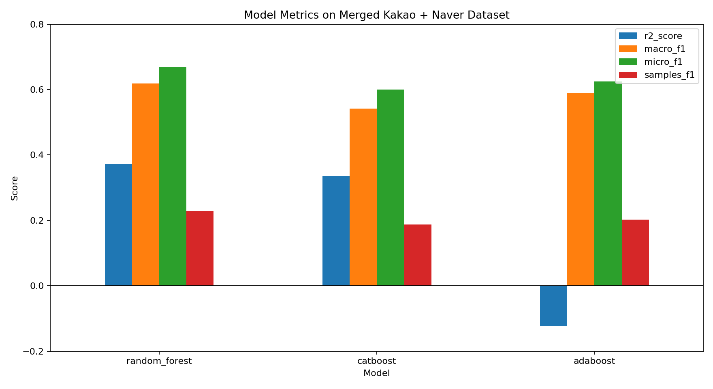

# 🍽️ Situational Restaurant Recommender

> **관계·상황·지역을 입력하면, 리뷰에서 학습한 분위기로 어울리는 맛집을 추천합니다.**
> 카카오맵 + 네이버 리뷰 15,045개 · 식당 630곳 · 멀티라벨 분류


---

## What it does

- **상황 기반 추천** — `관계(연인/친구/비즈니스)` × `목적(식사/술자리)` × `지역`을 받아 어울리는 식당을 정렬
- **리뷰에서 분위기 학습** — 별점이 아니라 *리뷰 텍스트*에서 맛·가성비·양·조도·소음·공간감을 수치화
- **멀티라벨** — 한 식당이 여러 상황에 적합할 수 있음 (연인+친구 동시 가능)
- **두 가지 인터페이스** — 웹 UI(자연어 입력) + 터미널 CLI

---

## Demo



> 웹앱에서 "연인이랑 강남에서 저녁" 같은 자연어를 입력하면 조건을 파싱해 추천 결과를 보여줍니다.

---

## How it works

```text
 ┌─────────────────────────────┐
 │  카카오맵 + 네이버 리뷰 수집     │   crawl_kakao.py · crawl_naver.py · merge_reviews.py
 │  630 식당 / 15,045 리뷰       │
 └──────────────┬──────────────┘
                ▼
 ┌─────────────────────────────┐
 │  리뷰 → 식당 단위 피처 변환      │   build_features.py
 │  • 감성: 맛 / 가성비 / 양        │   키워드 + 부정어 처리(12자 윈도우)
 │  • 분위기: 조도 / 소음 / 공간감   │   + Bayesian shrinkage(저리뷰 보정)
 │  • 좌석 유형 + 별점/리뷰수        │
 └──────────────┬──────────────┘
                ▼
 ┌─────────────────────────────┐
 │  멀티라벨 분류 (RandomForest)   │   train_model.py
 │  5-fold OOF · 5개 상황 라벨     │   data leakage 없는 교차검증
 └──────────────┬──────────────┘
                ▼
 ┌─────────────────────────────┐
 │  추천                         │   recommend.py (CLI) · web_app.py (Web)
 └─────────────────────────────┘
```

**5개 상황 라벨:** `couple` · `friend_meal` · `friend_drink` · `business_meal` · `business_drink`

---

## Get started

```bash
git clone https://github.com/mhtmtuna/restaurant-recommendation-project.git
cd restaurant-recommendation-project
pip install -r requirements.txt
python src/web_app.py        # http://127.0.0.1:8000
```

> `data/restaurants_features.csv`, `data/restaurant_label_scores.csv`가 포함되어 있어 **크롤링·재학습 없이 바로 실행**됩니다.

**터미널 추천:**
```bash
python src/recommend.py --relation 연인 --occasion 식사 --area 강남
```

| 옵션 | 값 |
|------|----|
| `--relation` | `연인` / `친구` / `비즈니스` |
| `--occasion` | `식사` / `술자리` |
| `--area` | `강남` / `건대` / `잠실` |
| `--top-k` | 상위 N개 (기본 10) |

---

## Proof

### 모델 성능 (630 식당, RandomForest 5-fold OOF)

| Label | Positive 샘플 | F1 |
|-------|:---:|:---:|
| `couple` | 154 | 0.65 |
| `friend_meal` | 165 | 0.69 |
| `friend_drink` | 178 | 0.75 |
| `business_meal` | 61 | 0.47 |
| `business_drink` | 48 | 0.54 |
| **macro F1** | — | **0.62** |
| **r2** | — | **0.37** |

### 왜 이렇게 골랐나 — 모델 비교



> RandomForest가 R²·Macro F1 모두 1위 · AdaBoost는 R²가 음수라 순위 추천에 부적합 → **RF 채택**

> 📑 **피처 중요도 · 통계 검정(t-test) · ablation · 출처 편향까지 전체 분석 과정 →
> [`docs/분석리포트.md`](docs/분석리포트.md)**
> _(차트 재현: `experiments/visualize_model_metrics.py` · `visualize_analysis_dashboard.py`)_

### 사람 평가 (Human Evaluation)

추천 결과를 **외부 평가자 5명**이 모델 점수를 가린 채 **상황 적합성**을 1~5점으로 blind 평가 (15조건 × 15평가 = **225건**):

| 관계 | 평균 적합도 (5점 만점) |
|------|:---:|
| 연인 | **4.44** |
| 친구 | **3.63** |
| 비즈니스 | **3.40** |
| **전체** | **3.70** |

> **모델 지표 ↔ 사람 평가 교차검증:** 모델 F1이 낮은 `business` 라벨(0.47~0.54)이 사람 평가에서도 가장 낮음(3.40). 서로 다른 두 방법이 같은 약점을 가리켜, "키워드 기반 라벨이라 평가가 순환적"이라는 비판을 방어한다.
> *(모델 점수를 숨긴 외부 5명 blind 평가 — 평가 기준은 [`experiments/human_eval_평가기준.md`](experiments/human_eval_평가기준.md) 참고)*

---

## Design

- **분위기 분해** — "분위기 좋다"를 조도·소음·공간감·좌석 유형으로 나눠 수치화
- **부정어 처리** — "안 맛있어요" → 긍정 카운트에서 제외 (양방향 12자 윈도우)
- **Bayesian Shrinkage** — 리뷰가 적은 식당은 같은 `지역×카테고리` 평균으로 부드럽게 보정
- **결측 처리** — 별점 없는 식당은 0이 아닌 **중앙값(median)** 으로 대치 (0은 "별점 0점=최악"으로 오인되므로)
- **멀티라벨 분류** — 한 식당의 여러 상황 적합성을 독립적으로 예측
- **자연어 입력** — 규칙 기반 슬롯 추출기로 "연인이랑 강남 저녁" → 구조화된 조건으로 변환

---

<details>
<summary><b>Project structure</b> (펼치기)</summary>

```text
restaurant-recommendation-project/
├─ config/
│  ├─ keywords.json          # 맛/가성비/분위기/상황 라벨 키워드 사전
│  └─ sampling_plan.json     # 크롤링 지역·카테고리·수집량 설정
├─ data/
│  ├─ raw_reviews.csv        # 원본 리뷰 (카카오+네이버 병합)
│  ├─ restaurants_features.csv     # 식당 단위 피처
│  ├─ restaurant_label_scores.csv  # 식당별 추천 점수 (OOF)
│  └─ model_report.json      # 라벨별 성능·분포 리포트
├─ models/
│  └─ restaurant_recommender.joblib   # 학습된 모델 (train_model.py 생성)
├─ src/
│  ├─ crawl_kakao.py · crawl_naver.py # 리뷰 수집 (Selenium)
│  ├─ merge_reviews.py       # 카카오+네이버 병합·중복 제거
│  ├─ build_features.py      # 리뷰 → 피처/라벨
│  ├─ train_model.py         # 멀티라벨 학습 (5-fold OOF)
│  ├─ recommend.py           # 터미널 추천
│  └─ web_app.py             # 웹 UI (자연어 + 선택형)
└─ experiments/              # 모델 비교·피처 중요도·사람 평가
```

**재수집·재학습 (선택):**
```bash
python src/crawl_kakao.py     # --show-browser 권장 (헤드리스 불안정)
python src/build_features.py
python src/train_model.py
```

</details>

---

## Limitations

| 항목 | 현재 상태 | 개선 방향 |
|------|---------|---------|
| `business` 라벨 약함 | positive 61/48개 (권장 30+는 넘으나 타 라벨 대비 적음), F1·사람 평가 모두 최저 | "회식/접대" 맥락이 리뷰에 드물게 명시됨 → LLM 라벨링 또는 human-labeled 셋 |
| 라벨 생성 방식 | 키워드 사전 기반 자동 라벨링 | 사람 평가로 교차검증 중 (순환성 보완) |
| 텍스트 표현 | 키워드 빈도(TF 수준) | 임베딩(KLUE-BERT 등)으로 문맥 이해 |
| 가격 피처 | 카카오·네이버 모두 수집 불가 → 상수 0이라 피처에서 제외 | 별도 소스 보완 시 복원 가능 |
| 지역 커버리지 | 강남·건대·잠실 3개 | 서울 전역 확장 |

> ⚠️ 크롤링은 공개 페이지를 천천히 수집하며, 서비스 약관·robots 정책을 확인하고 사용하세요. 카카오맵/네이버 화면 구조가 바뀌면 CSS 선택자 조정이 필요할 수 있습니다.
