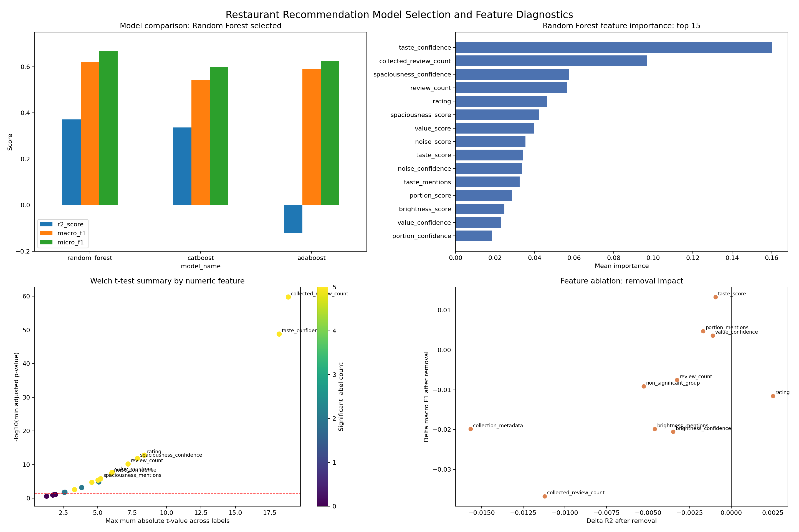
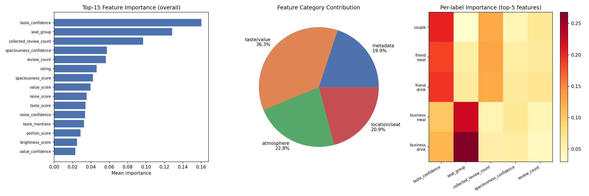

# 📊 분석 리포트 — 어떻게 결과를 얻었나

> 이 문서의 차트는 레포에 커밋된 분석 스크립트로 재현됩니다.
> ```bash
> python experiments/visualize_model_metrics.py        # → 모델 비교
> python experiments/visualize_analysis_dashboard.py   # → 종합 진단 대시보드
> python experiments/feature_importance.py             # → 피처 중요도
> ```
> 입력 데이터: `experiments/model_metrics_summary.csv` · `feature_importance.json` · `feature_ablation.csv` · `feature_significance.csv` · `source_aware_evaluation.json`

---

## 1. 데이터 & 검증 방식

| 항목 | 값 |
|------|----|
| 식당 | **630곳** (강남·건대·잠실) |
| 리뷰 | **15,045개** (카카오맵 + 네이버 병합) |
| 라벨 | **5개 상황** — `couple` · `friend_meal` · `friend_drink` · `business_meal` · `business_drink` |
| 검증 | **5-fold OOF**(Out-Of-Fold) — 같은 데이터로 학습·평가하는 누수(leakage) 차단 |
| 지표 | R²(순위 정확도) · Macro/Micro F1(라벨 분류) |

리뷰 텍스트에서 맛·가성비·양·조도·소음·공간감을 수치화하고(부정어 처리 + Bayesian shrinkage), 멀티라벨 분류로 식당별 상황 적합도를 학습했습니다.

---

## 2. 종합 진단 대시보드

모델 선택 · 피처 중요도 · 통계적 유의성 · ablation을 한 화면에 정리했습니다.



- **(좌상) 모델 비교** — RandomForest가 R²·Macro F1·Micro F1 전 지표 1위로 채택. AdaBoost는 R²가 음수라 순위 추천에 부적합.
- **(우상) RF 피처 중요도 top 15** — `taste_confidence`(맛 신뢰도)가 최상위, 리뷰에서 추출한 신호가 상위를 차지.
- **(좌하) Welch t-test** — 각 피처가 라벨을 통계적으로 유의하게 가르는지 검정(보정 p-value). 단순 중요도뿐 아니라 **유의성으로 교차 확인**.
- **(우하) Feature ablation** — 피처를 빼고 재학습했을 때의 성능 변화. **빠졌을 때 떨어지는 = 실제로 기여하는** 피처를 인과적으로 확인.

---

## 3. 무엇이 상황을 가르나 — 별점이 아니라 리뷰 신호



- **(좌) Top-15 중요도** — 상위권은 전부 리뷰 신호. 정작 **별점(rating)은 6위(0.046)에 불과**.
- **(중) 카테고리 기여도** — **맛·가격 36.3% · 분위기 22.8% · 위치·좌석 20.9% · 메타데이터 19.9%**. 리뷰 신호(앞 3개)가 약 80%, 별점 등 메타데이터는 20%.
- **(우) 라벨별 중요도 히트맵** — 상황마다 결정 피처가 다름. 비즈니스 계열은 `seat_group`(단체석)이 특히 크게 작용.

→ "별점 대신 리뷰를 읽는다"는 접근이 통한 핵심 근거입니다.

---

## 4. 정직한 한계 — 출처 편향(source bias)

카카오/네이버 중 **한 출처로만 학습하고 다른 출처로 검증**하면 성능이 붕괴합니다.

| 학습 → 검증 | R² | Macro F1 |
|------------|:---:|:---:|
| 혼합 출처 (실제 운영) | **0.37** | **0.62** |
| 카카오 학습 → 네이버 검증 | **−0.37** | 0.00 |
| 네이버 학습 → 카카오 검증 | **−2.95** | 0.14 |

- 출처가 달라지면 R²가 음수로 붕괴 → 모델이 식당 자체뿐 아니라 **출처별 글쓰기·평점 습관을 일부 학습**했다는 신호
- 숨기지 않고 공개합니다. 개선 방향은 **데이터 출처 균형화(source balancing)** — 계획: [`plan/source_balancing_plan.md`](../plan/source_balancing_plan.md)
- 재현: `python experiments/source_aware_evaluation.py`

---

## 한 줄 요약

> 별점이 아니라 **리뷰에서 읽어낸 신호**로 상황을 가르며(중요도·t-test·ablation 삼중 검증),
> 순위 품질(R²) 기준으로 **Random Forest**를 골랐고, **출처 편향이라는 한계까지 측정해 공개**했습니다.
