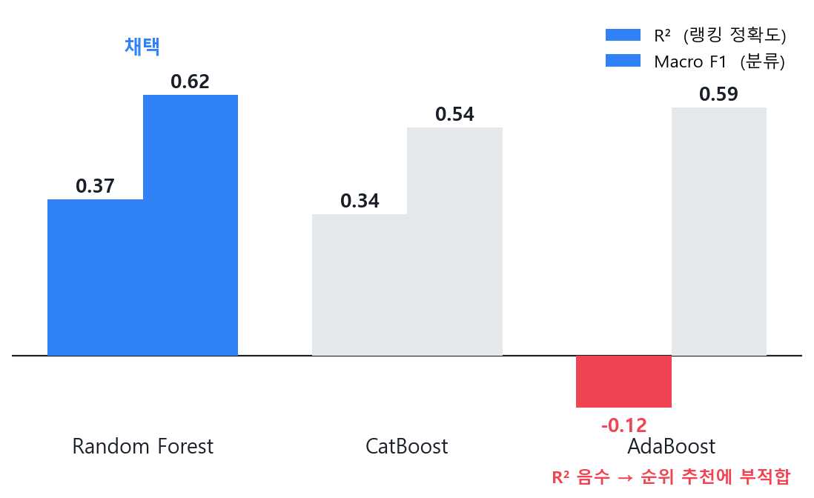
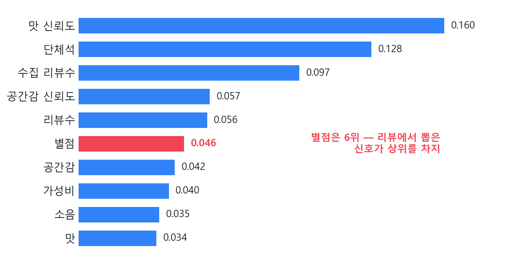
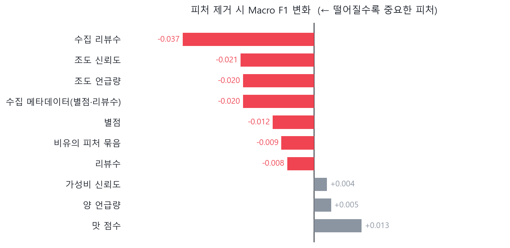
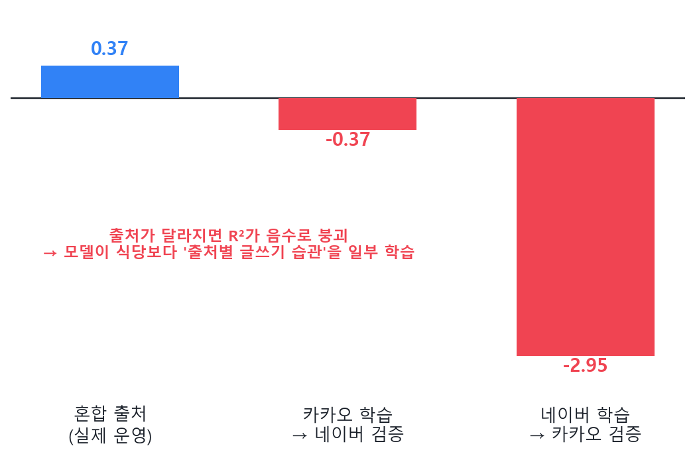

# 📊 분석 리포트 — 어떻게 결과를 얻었나

> 이 문서의 모든 차트는 레포에 커밋된 실험 산출물에서 **스크립트로 재현**됩니다.
> ```bash
> python experiments/make_readme_figures.py   # → docs/fig_*.png
> ```
> 입력 데이터: `experiments/model_metrics_summary.csv` · `feature_importance.json` · `feature_ablation.csv` · `source_aware_evaluation.json`

---

## 1. 데이터 & 검증 방식

| 항목 | 값 |
|------|----|
| 식당 | **630곳** (강남·건대·잠실) |
| 리뷰 | **15,045개** (카카오맵 + 네이버 병합) |
| 라벨 | **5개 상황** — `couple` · `friend_meal` · `friend_drink` · `business_meal` · `business_drink` |
| 검증 | **5-fold OOF**(Out-Of-Fold) — 같은 데이터로 학습·평가하는 누수(leakage) 차단 |
| 지표 | R²(순위 정확도) · Macro F1(라벨 분류) |

리뷰 텍스트에서 맛·가성비·양·조도·소음·공간감을 수치화하고(부정어 처리 + Bayesian shrinkage), 멀티라벨 분류로 식당별 상황 적합도를 학습했습니다.

---

## 2. 모델 선택 — 왜 Random Forest인가

RandomForest · CatBoost · AdaBoost를 **같은 피처·같은 5-fold**로 비교했습니다.



- **Random Forest가 R²(0.37)·Macro F1(0.62) 모두 1위** → 채택
- AdaBoost는 분류 F1(0.59)은 비슷해 보여도 **R²가 음수(−0.12)** — 점수의 *크기/순위*를 못 맞힌다는 뜻이라, 순위로 추천하는 본 과제엔 부적합
- 즉 "F1만 보면 안 되고, 추천은 순위 품질(R²)이 핵심"이라는 판단

---

## 3. 무엇이 상황을 가르나 — 별점이 아니라 리뷰 신호

학습된 RandomForest의 피처 중요도 상위 10개입니다.



- 상위권은 전부 **리뷰에서 뽑아낸 신호**(맛 신뢰도·단체석·공간감·소음 등)
- 정작 **별점(rating)은 6위(0.046)에 불과** — "좋은 집"은 알려줘도 "이 상황"은 못 가름
- 카테고리로 묶으면: **맛·가격 36.3% · 분위기 22.8% · 위치·좌석 20.9% · 메타데이터 19.9%**
  → 리뷰 신호(앞 3개)가 약 80%, 별점 등 메타데이터는 20%

이것이 "별점 대신 리뷰를 읽는다"는 접근이 통한 핵심 근거입니다.

---

## 4. 피처 검증 — ablation (제거 영향 분석)

피처를 하나씩 빼고 재학습해, **빠졌을 때 성능이 떨어지는 = 실제로 중요한** 피처를 확인했습니다.



- **수집 리뷰수**를 빼면 Macro F1이 −0.037로 가장 크게 하락 → 가장 중요한 피처
- 조도·메타데이터·리뷰수 계열도 제거 시 성능 하락(중요)
- 반대로 `맛 점수`처럼 빼도 오히려 +0.013 오르는 피처도 있어, 중복·잡음 피처 정리 여지를 확인

→ 중요도(importance)뿐 아니라 **인과적 기여(ablation)** 로 교차 확인한 결과입니다.

---

## 5. 정직한 한계 — 출처 편향(source bias)

카카오/네이버 중 **한 출처로만 학습하고 다른 출처로 검증**하면 어떻게 될까?



- 혼합 출처(실제 운영)에서는 R² 0.37
- 카카오→네이버 검증 시 **R² −0.37**, 네이버→카카오 시 **R² −2.95** 로 붕괴
- 모델이 식당 자체뿐 아니라 **출처별 글쓰기·평점 습관을 일부 학습**했다는 신호

→ 숨기지 않고 공개합니다. 개선 방향은 **데이터 출처 균형화(source balancing)** 입니다. (계획: `plan/source_balancing_plan.md`)

---

## 한 줄 요약

> 별점이 아니라 **리뷰에서 읽어낸 신호**로 상황을 가르며(피처 중요도·ablation 이중 검증),
> 순위 품질(R²) 기준으로 **Random Forest**를 골랐고, **출처 편향이라는 한계까지 측정해 공개**했습니다.
